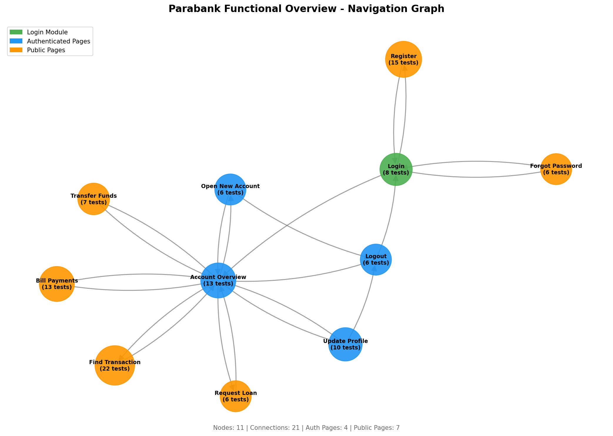

# Example Markdown Output with Verification

This shows what the new markdown export format looks like with verification data.

## Summary

### Verification Coverage

| Metric | Count |
|--------|-------|
| Positive Tests | 20 |
| Tests that Write State | 15 |
| Tests that Read State | 12 |
| Tests with Verification Links | 14 |
| Tests with Pre-Verification Steps | 15 |
| Tests with Post-Verification Steps | 15 |

**State Categories:**

- **Written:** account_balance, user_profile, session_status
- **Read:** account_balance, user_profile
- **Unverified:** session_status

---

## Test Cases

### Transfer Funds

#### Functional Tests

**TRAFUN-001** - Transfer funds between accounts

- **Priority:** High
- **Preconditions:** User is logged in with multiple accounts

- **Reads State:** (none)
- **Writes State:** account_balance, transaction_history
- **Verified By:** ACCOVR-001

**Pre-Verification Steps:**
1. Navigate to Accounts Overview
2. Note source account balance
3. Note destination account balance

**Test Steps:**
1. Select source account
2. Select destination account
3. Enter amount: $100
4. Click Transfer

**Post-Verification Steps:**
1. Navigate to Accounts Overview
2. Verify source balance decreased by $100
3. Verify destination balance increased by $100

**Expected Result:** Transfer confirmation is displayed

---

**ACCOVR-001** - View account balances

- **Priority:** High
- **Preconditions:** User is logged in

- **Reads State:** account_balance, account_list
- **Writes State:** (none)

**Test Steps:**
1. Navigate to Accounts Overview
2. View list of accounts
3. Check balance for each account

**Expected Result:** All account balances are displayed correctly

---

## Verification Chain

This section shows which test cases verify the results of other tests.

| Test ID | Test Name | Writes State | Verified By |
|---------|-----------|--------------|-------------|
| TRAFUN-001 | Transfer funds between accounts | account_balance, transaction_history | ACCOVR-001 |
| USERUPD-001 | Update user profile | user_profile | USERPROF-001 |
| LOGIN-001 | Valid login | session_status | ACCOVR-001 |

---

## Navigation Graph

### Pages

| Module | URL | Auth Required | Test Cases |
|--------|-----|---------------|------------|
| Login | /login | No | 5 |
| Transfer Funds | /transfer | Yes | 8 |
| Account Overview | /overview | Yes | 6 |
